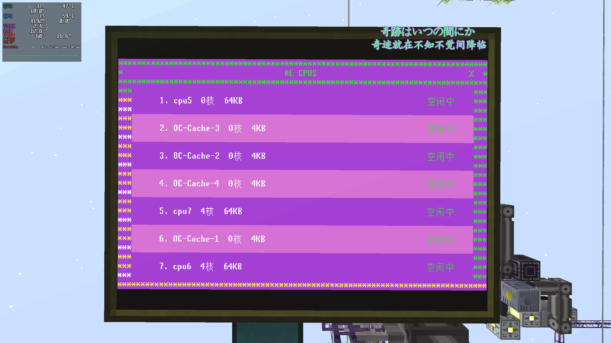
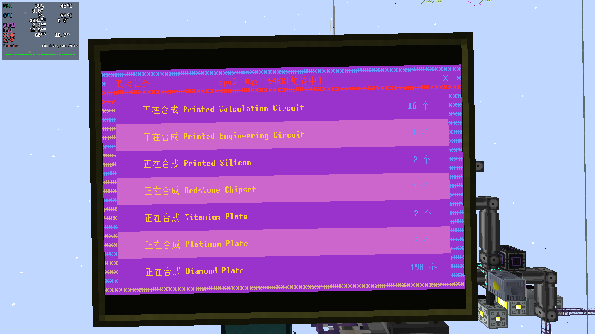
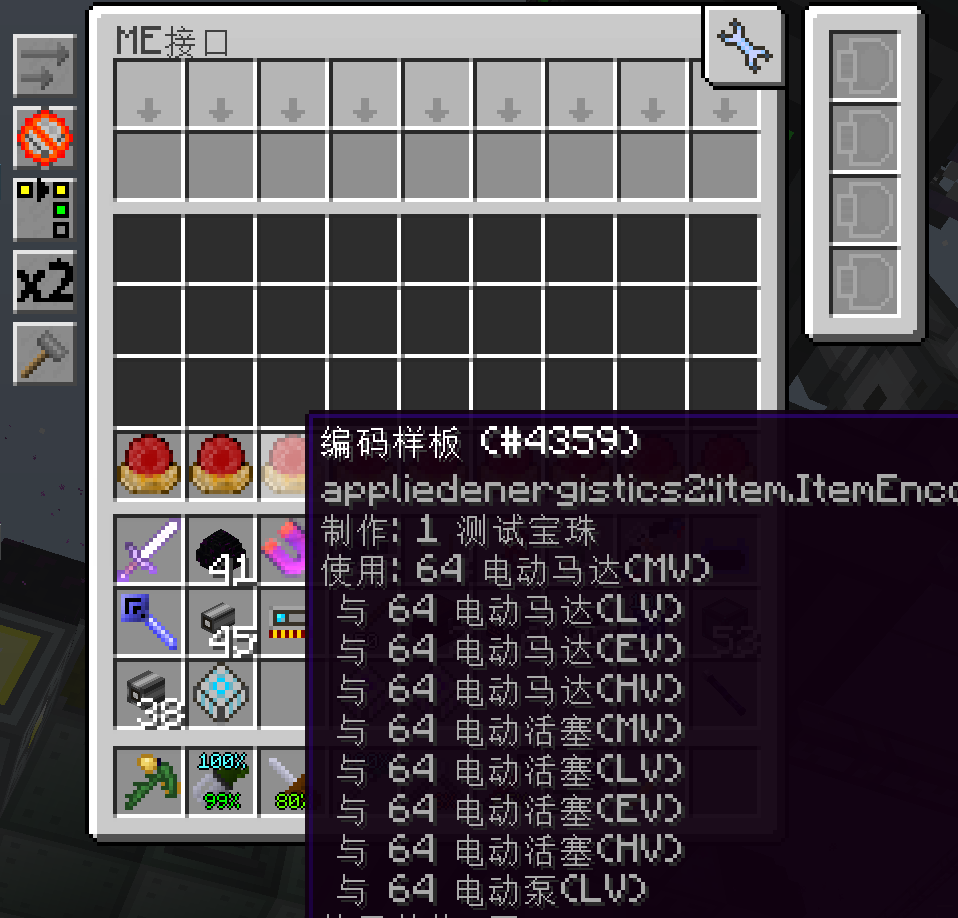
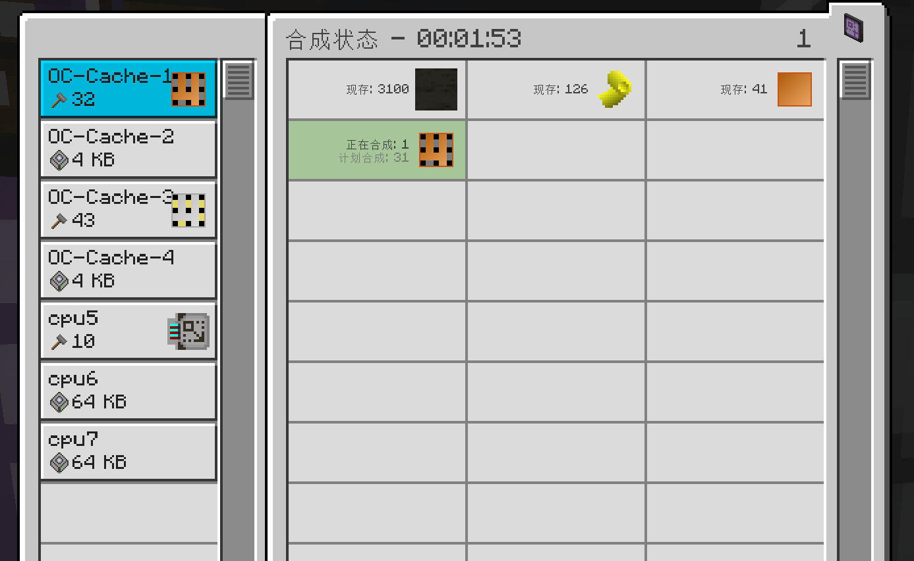

# AE CPU Monitor

在OC屏幕中展示AE的处理器制造情况，并且可以设定缓存物品数量。它看起来像这样：

  

## 需求

* T1 CPU
* T1 RAM * 2
* T2 GPU
* 键盘
* 适配器
* T1 数据库
* ME 接口

## 摆放

确保摆放过程中，适配器紧急挨住ME接口，并且ME接口需要接入到ME网络之中。
并且在适配器中放入T1数据库（或更高级的数据库）。

## 设定缓存物品

在ME接口中插入样板后，程序将自动读取样板中的输入槽区域物品及数量，并检测
AE中是否含有指定数量的物品，若未含有则提交制作四分之一的指定数量物品的请求，
至CPU前缀为“OC-Cache”的CPU进行制作。

  

