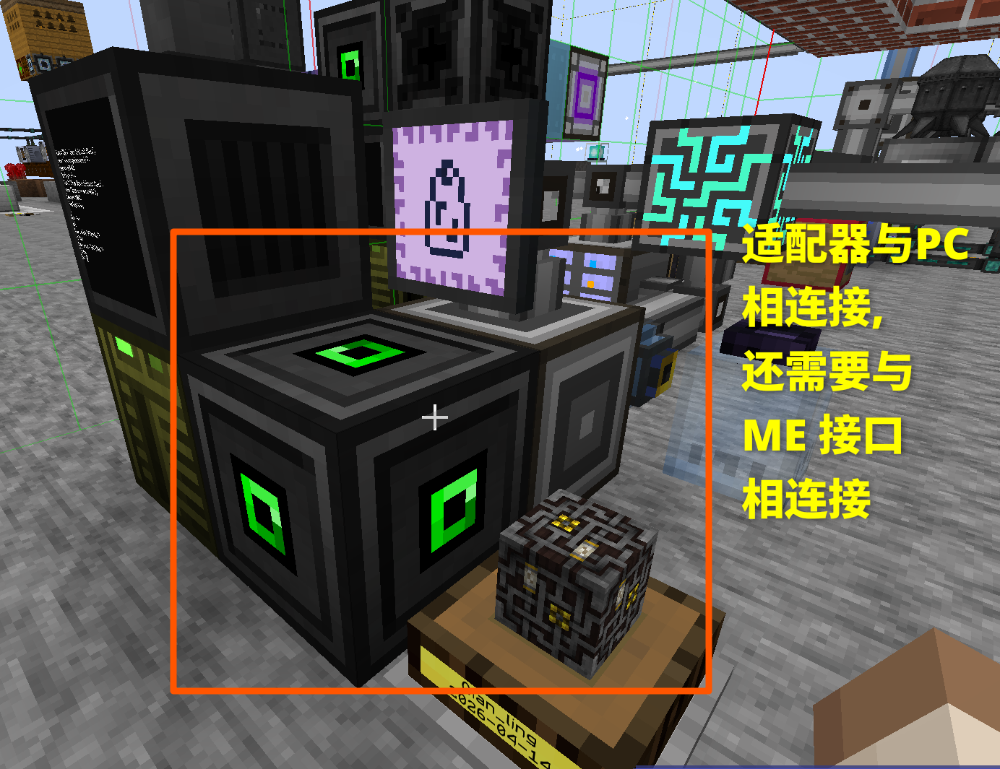
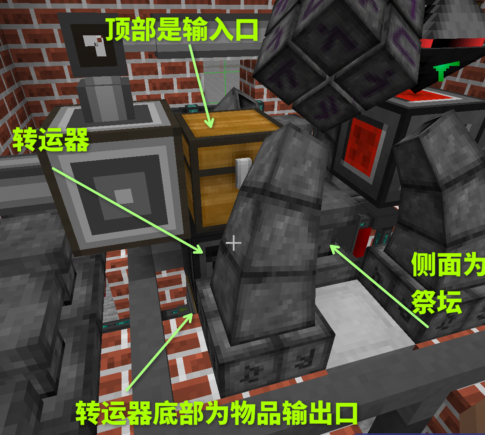
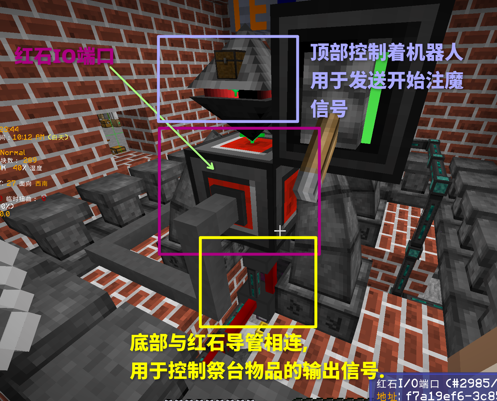
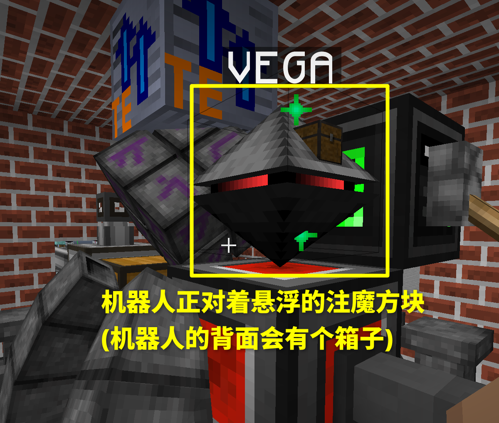
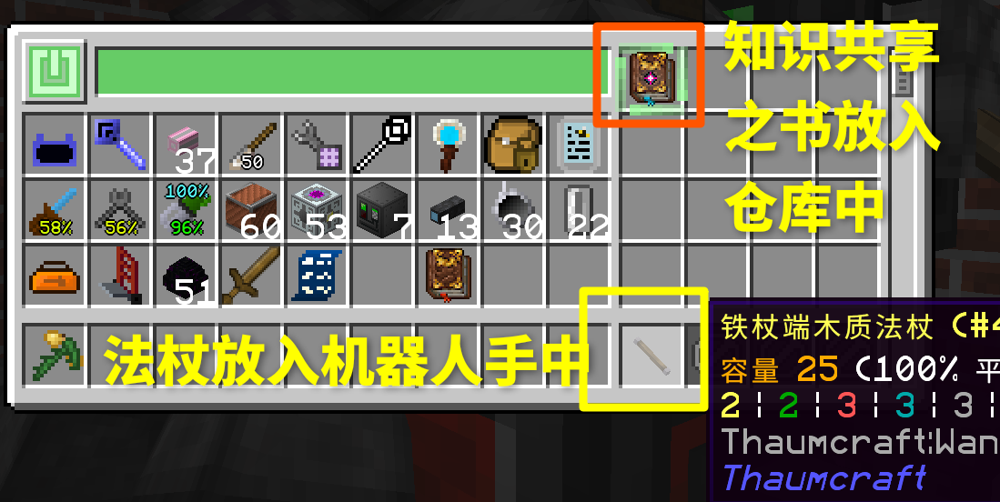
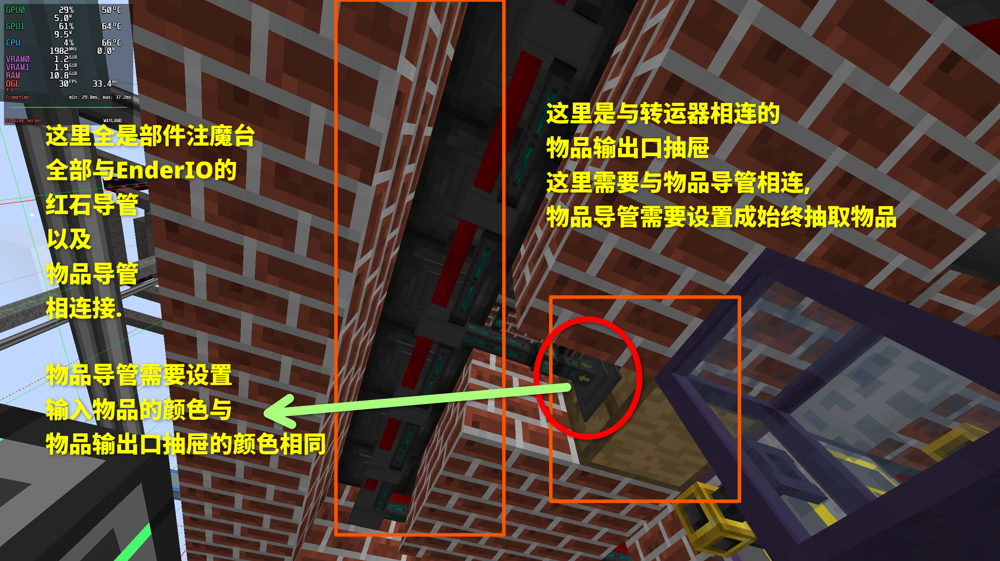
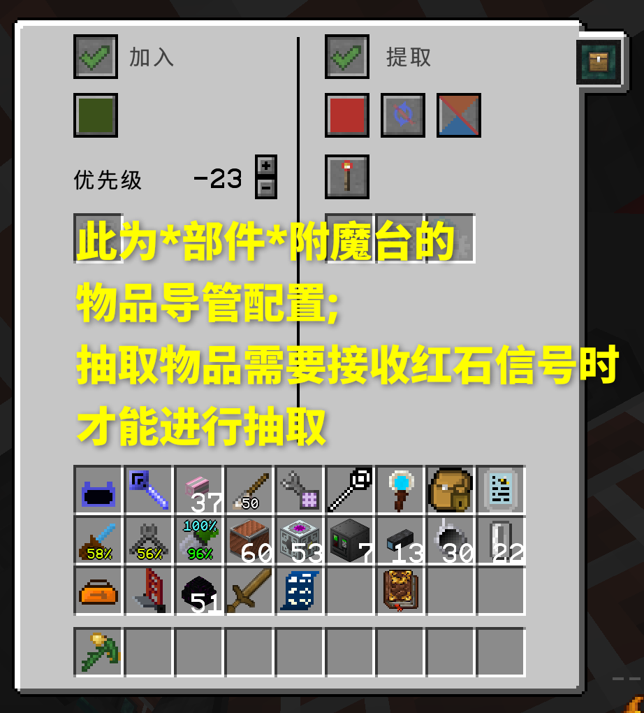
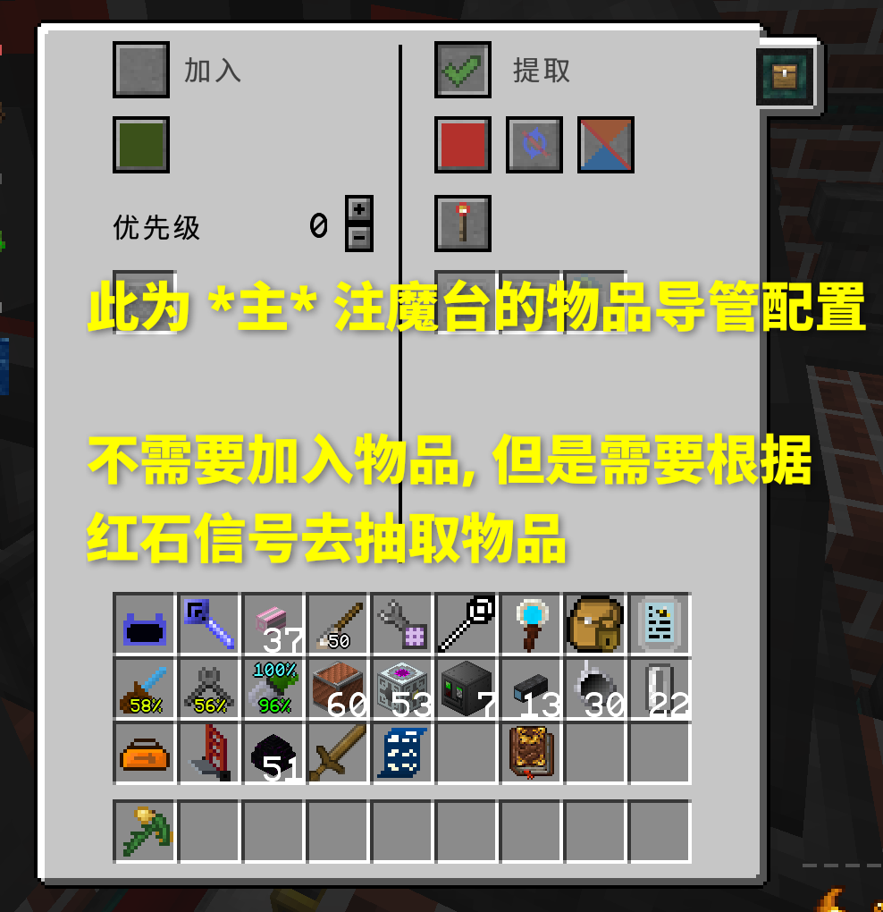
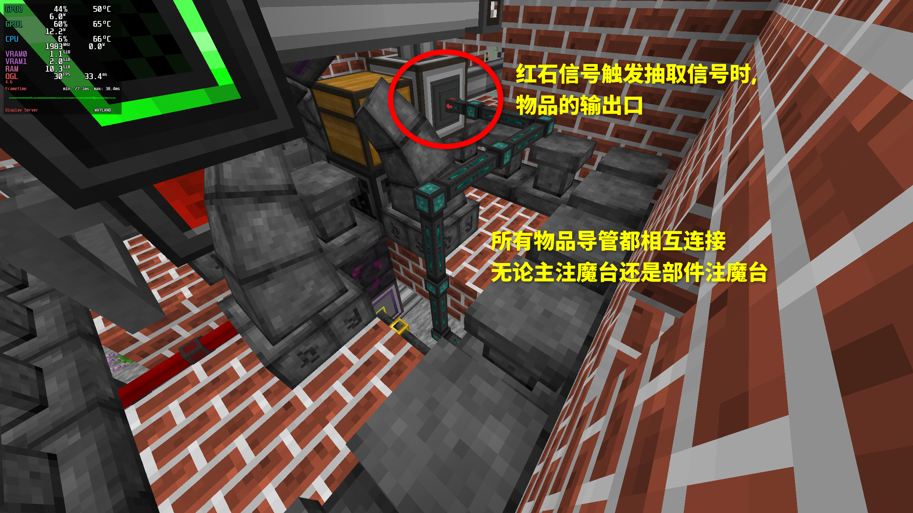

# Auto Infusion

Auto Infusion 是一个 GTNH 整合包中的 OC 自动化注魔方案的简易实现. **本方案基于 AE 物流**

## 包含功能

- 源质检测
- 自动清理注魔祭台

## 目录结构

本方案包含 OC 主体代码外还包含一个辅助客户端Mod, 辅助客户端Mod为可选项, 目的是易于导出注魔配方为 Lua 配置文件, 用于源质检测

- `oc`: OC代码主体
- `TCInfusionRecipeForOC`: 一个辅助客户端Mod, 用于导出注魔配方为 lua 表.

## 单实例部署

### OC配置要求

以下是最低要求

- OC 主机一台
  - T1 主机
  - T1 显卡
  - T1 内存
  - T1 处理器
  - T1 硬盘
  - EEPROM OpenOS
- 转运器 1 个
- 红石IO端口 1 个 (方块版本)
- 适配器 1 个
- OC 机器人一个
  - 物品栏升级
  - 物品栏交互升级
  - T1 红石卡
  - EEPROM

## 注魔祭坛配置

### 适配器配置

适配器用于检测 ME 接口中的所有源质的数量, 需要使用适配器与ME接口相连, 具体摆放可以参考下图, 也可以自己酌情放置:

### 转运器配置

转运器与 PC 机相连, 此外还连接着注魔物品输入口, 主祭台输入口, 其他祭台输入口.

具体如图所示, 图中顶部是注魔配方输入口, AE会将注魔配方需要的所有物品都输入到这个箱子中. 底部有个**抽屉**, 为其他祭台的输入口, 这个抽屉与其他祭台相连接. 转运器的侧面为主祭台.

### 红石IO端口配置

红石IO端口与 PC 机相连, 并且控制着注魔物品合成信号和注魔物品输出信号.

具体如图所示, 顶部与机器人相连, 用于向机器人发送开始注魔信号. 底部与 Ender IO 的红石导管相连, 用于发送抽取注魔台中的物品信号.

### OC机器人配置

OC机器人主要是作为触发注魔合成的一个手段. **机器人可以按需替换成其他能够通过红石信号触发注魔的东西**. 这里用机器人的主要目的为前期容易获取到.

机器人摆放如图.

机器人的仓库布局需要像图中放置.

### 注魔台配置

注魔台分为 **主注魔台** 以及 **部件注魔台**. **主注魔台** 在祭台中心并仅有一个. **部件注魔台** 有很多, 在祭台四周.

这里使用 Ender IO 物品导管以及红石导管控制注魔台上的物品. 

#### 部件注魔台配置

先从部件注魔台的导管连接开始, 如图所示:

部件注魔台所连接到的物品导管配置如图所示:

这里的部件注魔台相连接的物品导管中的 *加入优先级* 可以随意设置或者不设置, 只要保证祭台的稳定度达到一个安全阈值即可.

#### 主注魔台配置

主注魔台的导管连接与部件注魔台的导管连接在一起, 但是导管配置不同, 主注魔台的导管配置如图所示:

#### EnderIO 物品导管输出

物品输出的可以依照自己的实际需求输出到你想要的容器即可, 这里输出到 ME 接口中:

#### ME 接口配置