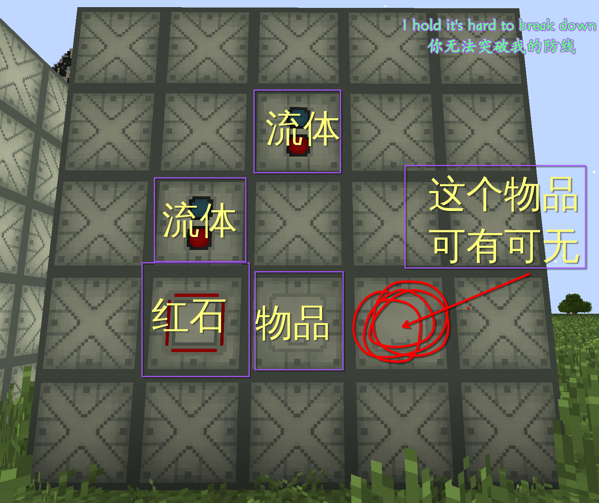
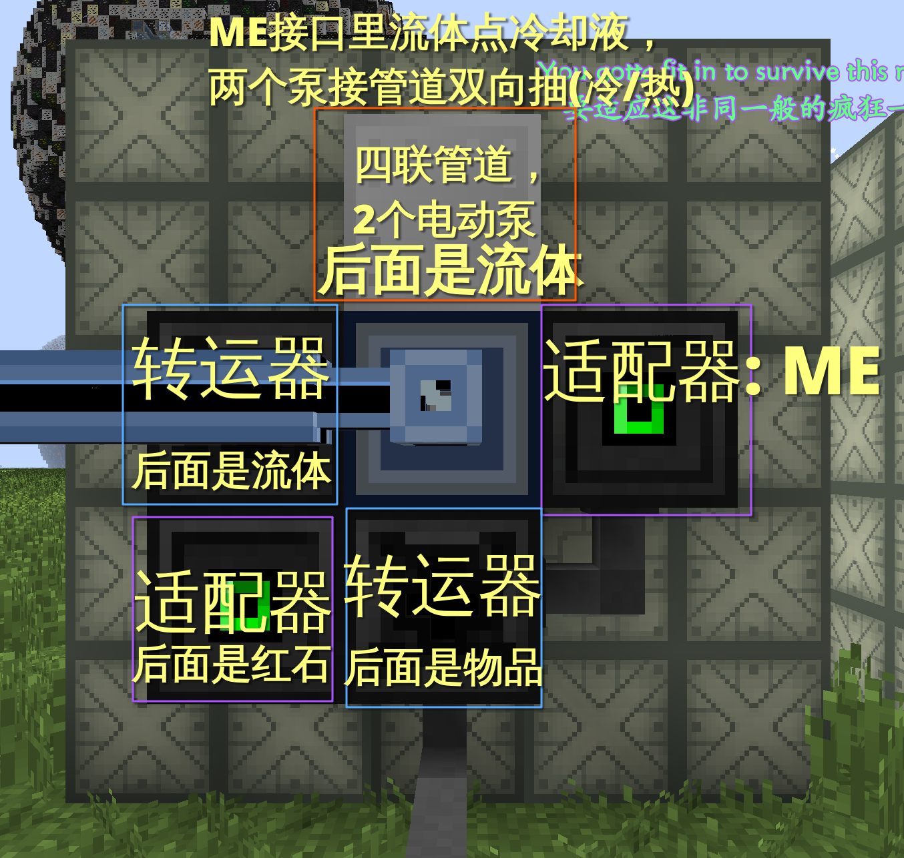

# Fluid Reactor Controller

本程序用于控制流体反应堆，包含冷却液检查、堆温检查和布局摆放功能。

## 要求

* T1 数据库

其他 CPU 什么的依据自己堆数量情况增加减少，也可以看情况使用机架+服务器。

## 摆放




## 工具

tools 文件夹下有若干工具，在 `main.lua` 目录下，使用以下指令分别运行相关工具。

新建反应堆：

```shell
./tools/new_reactor
```

新建反应堆物品摆放布局：

```shell
./tools/new_shape
```

在 `shape` 文件夹下存放着一个 **1408 HU** 的布局文件，在新建反应堆时，输入 `1408` 就能指定该布局。
