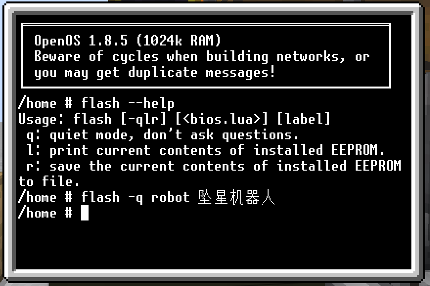
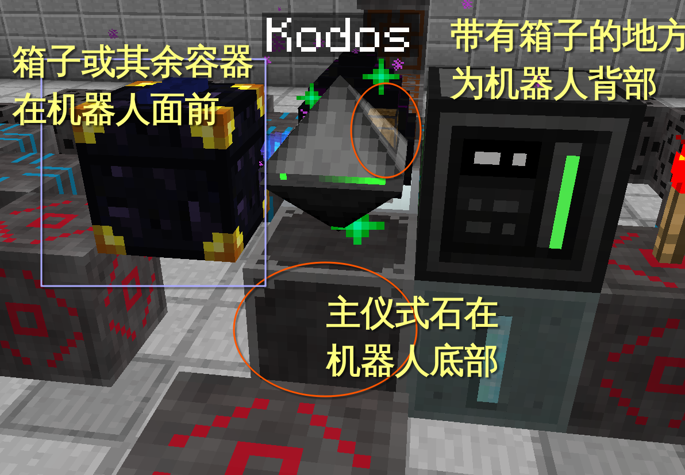
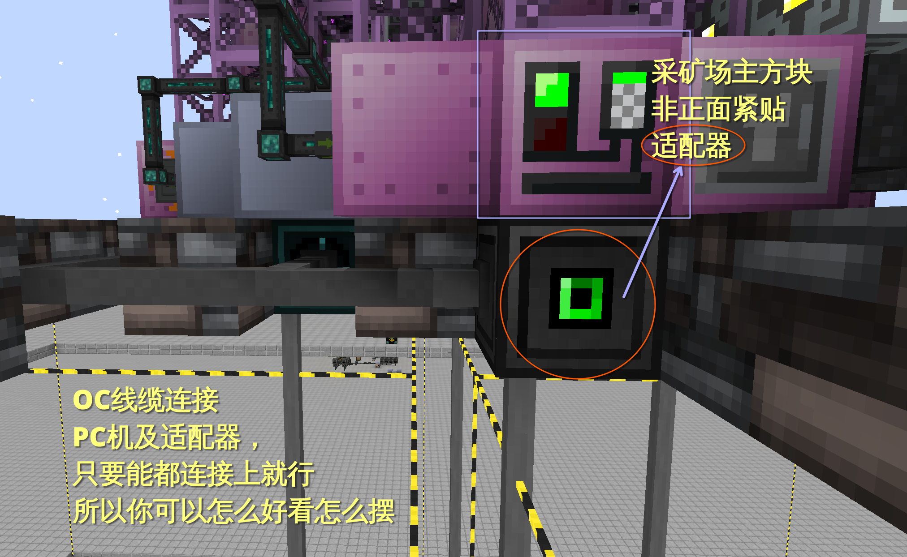
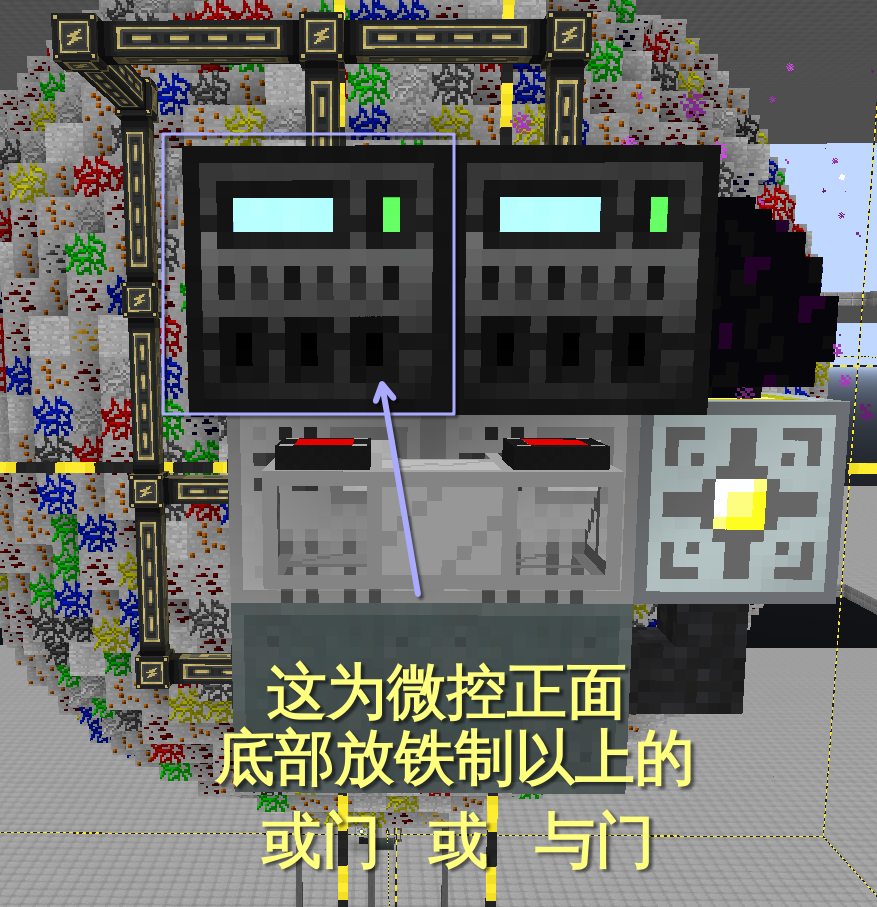
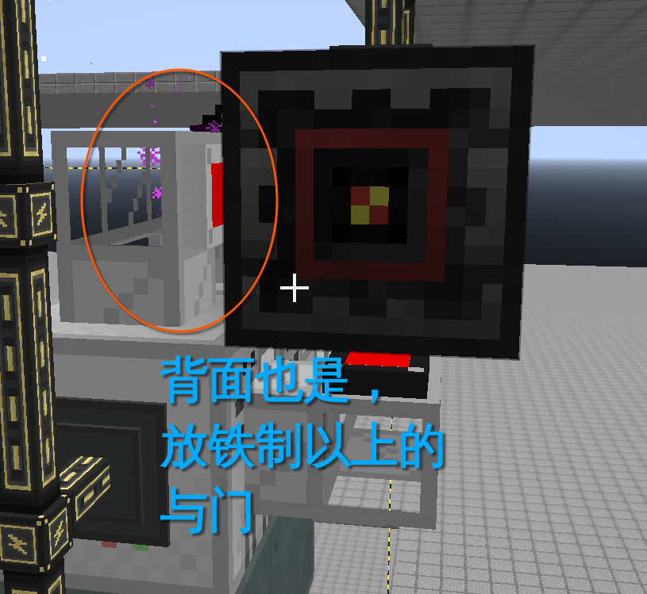

# Mark of the Falling Tower Controller

全矿类坠星标位自动化。需要使用微控、PC机以及机器人，但是不需要硬盘。

## 需求

### 机器人

机器人一台。

* T2无线网卡
* 物品栏升级
* 物品栏交互升级
* EEPROM

### 微控

微控若干，用来控制BC填充机，1个微控控制一台BC填充机。

* T2无线网卡
* T1红石卡
* EEPROM

### PC

PC一台，用来控制采矿场。一个采矿场接一个适配器（紧贴主方块），并且与PC相连

* T2无线网卡
* 适配器若干
* EEPROM

## 安装固件

安装时需要一台机器辅助烧录程序至 **EEPROM** 中。
`microcontroller.lua` 为**微控**固件、`pc.lua` 为 **PC** 固件，`robot.lua` 为 **机器人** 固件。

在**辅助PC机** (请预先装好OpenOS)上准备好该三个文件后，取下当前**辅助PC机**上的EEPROM, 换上需要烧录的EEPROM,
在辅助机上输入 `flash -q microcontroller.lua 坠星微控` 烧录微控EEPROM、`flash -q pc.lua 坠星PC` 烧录PC的EEPROM，
最后输入 `flash -q robot.lua 坠星机器人` 烧录机器人的EEPROM. 每次使用完指令后，记得拿出 EEPROM 换上新的 EEPROM，
若每次指令操作正确，每次拿出来的EEPROM的物品名字都会发生改变。之后将烧录好的EEPROM与PC或者微控或者机器人，
在合成栏中合成就好了。

 

## 摆放设备

### 摆放机器人

机器人摆放如下图：

### 摆放PC机

在摆放完成后需要先开机后再关机。

### 摆放微控

微控要控制BC填充机，因为BC填充机仅受门控制，所以需要准备若干铁制与门。
在摆放完成后需要先开机后再关机。

  
  
  
  

## 使用

在机器人前方箱子中放入陨星的物品，机器人会依次召唤。
你想怎么给箱子投放物品都可以，只要有物品机器人就会被激活。
