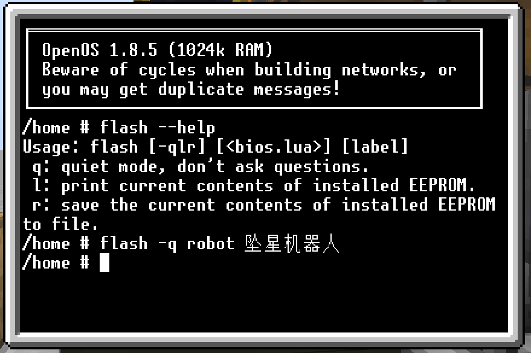
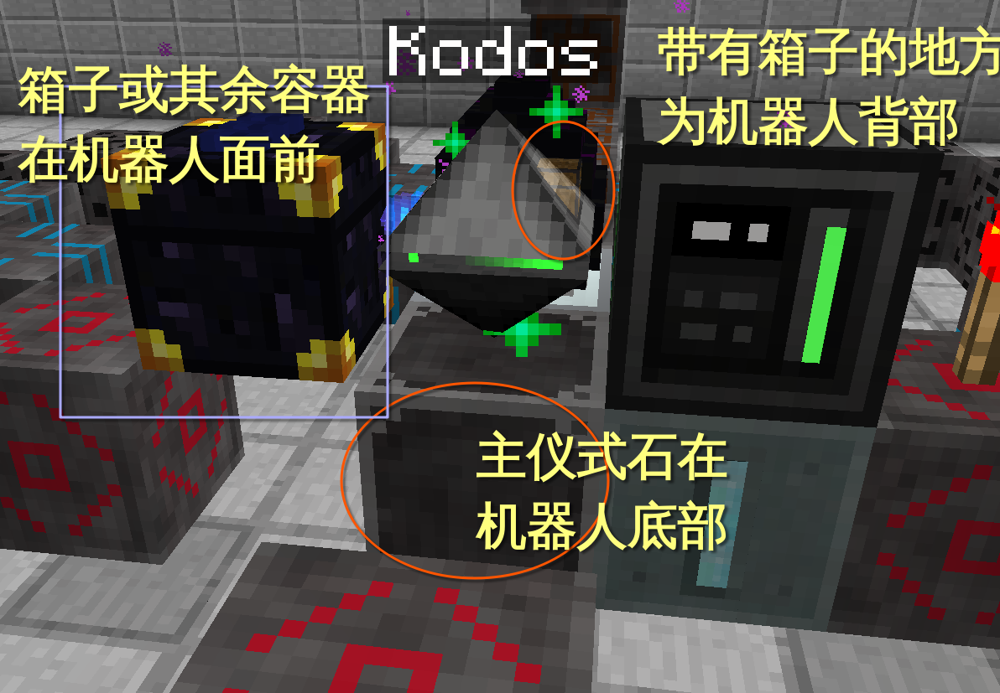
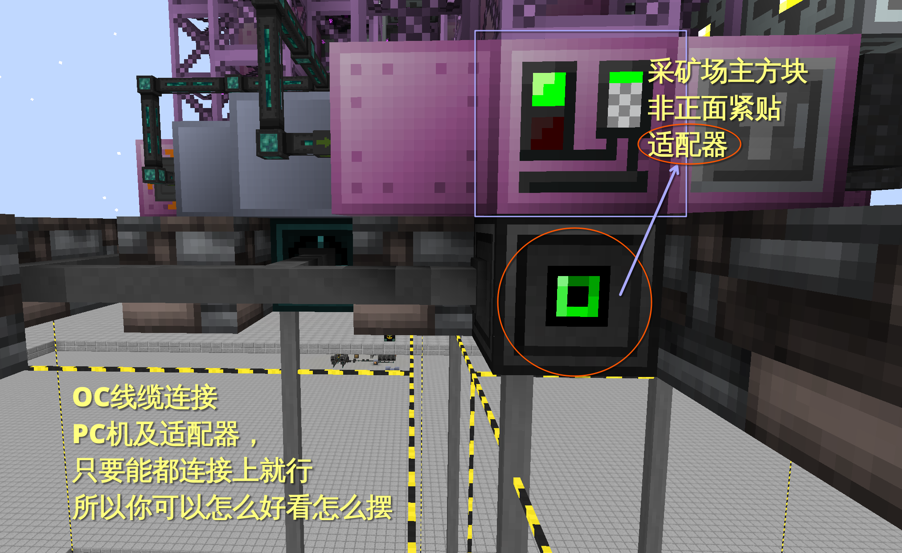
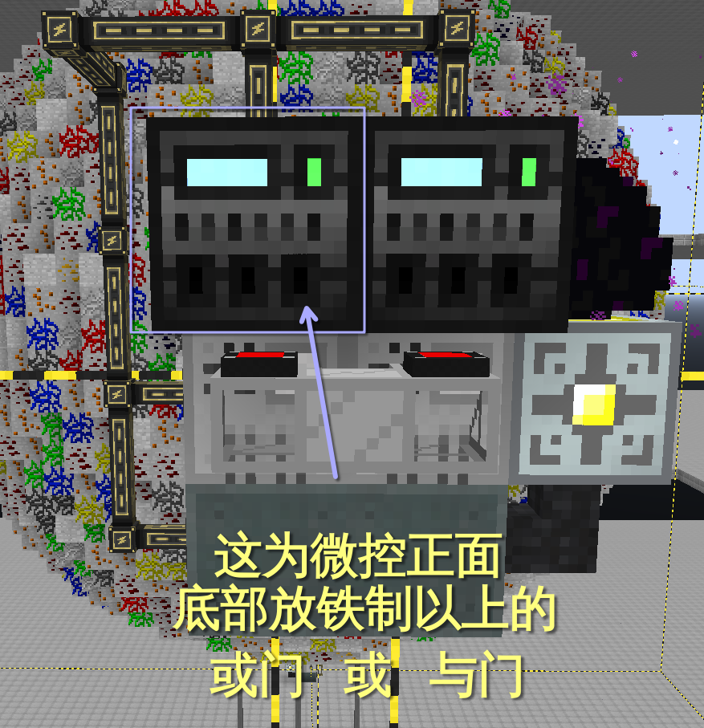
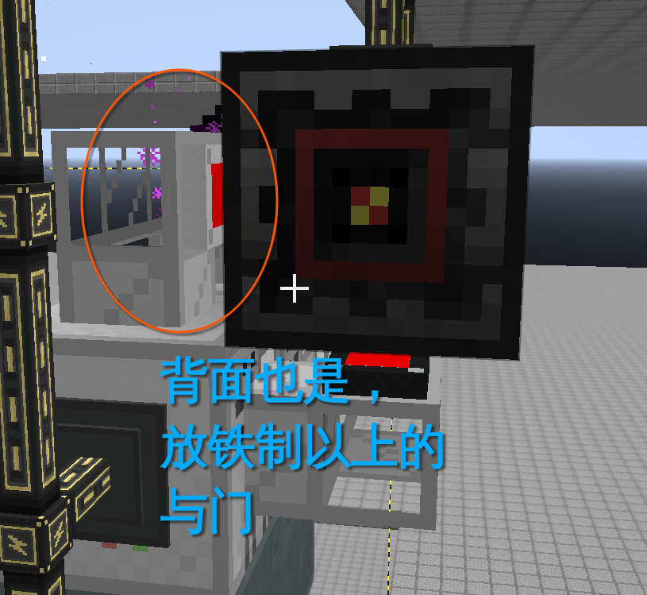
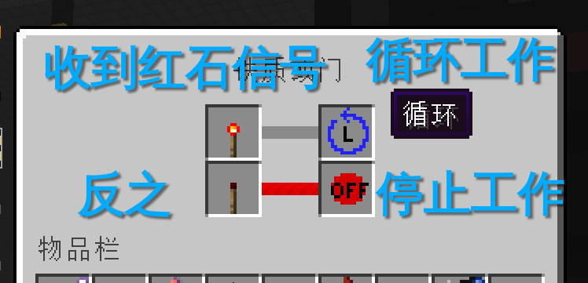

# Mark of the Falling Tower Controller

全矿类坠星标位自动化。需要使用微控、PC机以及机器人，但是不需要硬盘。

## 需求

### 机器人

机器人一台。

* T2无线网卡
* 物品栏升级
* 物品栏交互升级
* EEPROM

### 微控

微控若干，用来控制BC填充机，1个微控控制一台BC填充机。

* T2无线网卡
* T1红石卡
* EEPROM

### PC

PC一台，用来控制采矿场。一个采矿场接一个适配器（紧贴主方块），并且与PC相连

* T2无线网卡
* 适配器若干
* EEPROM

## 安装固件

安装时需要一台机器辅助烧录程序至 **EEPROM** 中。
`microcontroller.lua` 为**微控**固件、`pc.lua` 为 **PC** 固件，`robot.lua` 为 **机器人** 固件。

### 固件配置

**你可能需要先配置固件.**

#### 配置端口号

三个固件中在顶部都含有 `PORT` 常量, 默认其常量值为 `local PORT = 10000` 代表通信端口号 `10000`. 需要注意的是, 这个通信端口号不能与其他的网卡/无线网卡的通信端口号相同, 以免发生通信错误问题.

**如果你需要部署多个实例, 那么不同实例之间需要使用不同的端口号.**

#### 配置最大数量的填充机

在 **机器人固件** 中, 拥有一个常量 `MAX_FILLER`, 其默认值为 `local MAX_FILLER = 8`, 代表最大使用 8 个填充机. 如果你需要使用更多或者更少的填充机, 那么需要改写这个值为你想要的值.

**最好将这个常量的值与你实际使用的填充机数量相吻合.**

此外还有一个常量用于控制超时时间 `local DISCOVER_TIMEOUT = 5`, 默认值为 5 秒.

#### 烧录固件

在**辅助PC机** (请预先装好OpenOS)上准备好该三个文件后，取下当前**辅助PC机**上的EEPROM, 换上需要烧录的EEPROM,
在辅助机上输入 `flash -q microcontroller.lua 坠星微控` 烧录微控EEPROM、`flash -q pc.lua 坠星PC` 烧录PC的EEPROM，
最后输入 `flash -q robot.lua 坠星机器人` 烧录机器人的EEPROM. 每次使用完指令后，记得拿出 EEPROM 换上新的 EEPROM，
若每次指令操作正确，每次拿出来的EEPROM的物品名字都会发生改变。之后将烧录好的EEPROM与PC或者微控或者机器人，
在合成栏中合成就好了。

 

## 摆放设备

### 摆放机器人

机器人摆放如下图：

机器人手上需要拿仪式激活物品. 如果机器人仓库中含有宝珠, 则会尝试获取LP网络中的LP数量, 并仅有在LP数量大于等于宝珠最大数量的时候才会尝试启动坠星.

### 摆放PC机

在摆放完成后需要先开机后再关机。

### 摆放微控

微控要控制BC填充机，因为BC填充机仅受门控制，所以需要准备若干铁制与门。
在摆放完成后需要先开机后再关机。

  
  
  
  

## 使用

在机器人前方箱子中放入陨星的物品，机器人会依次召唤。
你想怎么给箱子投放物品都可以，只要有物品机器人就会被激活。

## FAQ

### 为什么在一段时间不用坠星的时候, 机器人响应坠星时会变慢?

机器人使用了指数级回退等待策略, 在没有任务时(或者LP不够时)会尝试先等待 1 秒, 2 秒, 4 秒 ... 一直到 60 秒封顶. 若有任务时, 则会将等待时间恢复为 1 秒. 具体时间可以更改机器人固件中的常量.
